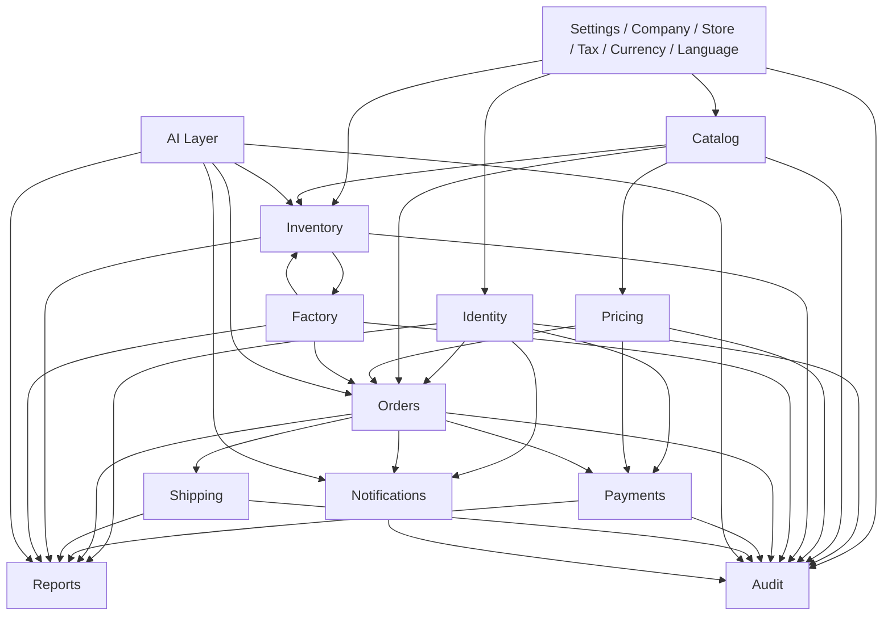

# System ERD (Business Level)

This document presents a high-level enterprise data model for a scalable ERP + e-commerce platform serving a clothing manufacturing business. It is intentionally business-focused and avoids implementation details such as SQL, Prisma, or framework-specific code.

The design supports current operations across factory, warehouse, retail, online store, payments, shipping, reporting, and future extensions such as mobile apps, AI assistants, and multi-location operations.

---

# 1. High-level explanation of the architecture

This architecture is organized as a shared business domain model with a clear separation between:

- Identity and access control
- Catalog and pricing
- Inventory and factory operations
- Customer orders and fulfillment
- Payments and financial tracking
- Notifications and automation
- Reporting and business intelligence
- System-wide configuration and multi-location settings

At the center of the model are the core business entities:

- Company and Store define the operating business context.
- Account, CustomerProfile, and EmployeeProfile represent the people and actors in the system.
- Product, ProductVariant, and InventoryItem connect merchandising to operations.
- Orders, Payments, and Shipments connect commerce to fulfillment.
- Factory entities such as RawMaterial, PurchaseOrder, ProductionOrder, and FinishedGoods connect production to inventory and sales.
- AI and notification entities allow the platform to evolve into a connected, intelligent business platform.

The design assumes a multi-tenant, multi-location, and multi-channel future. This means the model supports:

- Multiple warehouses and stores
- Multiple price strategies
- Multiple payment and shipping methods
- Future AI-driven automation and assistant workflows
- Strong auditability for governance and compliance

---

# 2. Module dependency diagram

This diagram shows that the platform is not a set of isolated modules. Instead, the business domains are highly connected and share common business concepts such as products, inventory, orders, customers, locations, and auditability.

---

# 3. Mermaid ER Diagram

```mermaid
erDiagram
    COMPANY ||--o{ STORE : owns
    COMPANY ||--o{ TAX : defines
    COMPANY ||--o{ CURRENCY : uses
    COMPANY ||--o{ LANGUAGE : supports
    COMPANY ||--o{ SYSTEM_SETTINGS : configures

    ACCOUNT ||--o| CUSTOMER_PROFILE : represents
    ACCOUNT ||--o| EMPLOYEE_PROFILE : represents
    ACCOUNT ||--o{ SESSION : authenticates
    ACCOUNT ||--o{ AUDIT_LOG : creates

    ROLE ||--o{ ROLE_PERMISSION : contains
    PERMISSION ||--o{ ROLE_PERMISSION : grants
    EMPLOYEE_PROFILE ||--o{ EMPLOYEE_ROLE : holds
    ROLE ||--o{ EMPLOYEE_ROLE : assigned_to

    CUSTOMER_PROFILE }o--|| CUSTOMER_CLASSIFICATION : classified_as
    CUSTOMER_PROFILE ||--o{ ADDRESS : has
    CUSTOMER_PROFILE ||--o{ CART : owns
    CUSTOMER_PROFILE ||--o{ ORDER : places
    CUSTOMER_PROFILE ||--o{ PAYMENT : makes
    CUSTOMER_PROFILE ||--o{ NOTIFICATION : receives
    CUSTOMER_PROFILE ||--o{ AI_CONVERSATION : starts

    CATEGORY ||--o{ PRODUCT : contains
    BRAND ||--o{ PRODUCT : brands
    PRODUCT ||--o{ PRODUCT_VARIANT : has
    PRODUCT ||--o{ PRODUCT_IMAGE : has
    PRODUCT ||--o{ VARIANT_IMAGE : may_have
    PRODUCT_VARIANT ||--o{ VARIANT_IMAGE : uses
    PRODUCT_VARIANT ||--o{ INVENTORY_ITEM : tracked_as
    PRODUCT_VARIANT ||--o{ PRODUCT_PRICE : priced

    PRICE_GROUP ||--o{ PRODUCT_PRICE : defines
    PRODUCT_PRICE }o--|| DISCOUNT : may_have
    DISCOUNT ||--o{ COUPON : generated_from
    PROMOTION ||--o{ COUPON : uses

    WAREHOUSE ||--o{ INVENTORY_ITEM : stores
    WAREHOUSE ||--o{ INVENTORY_MOVEMENT : records
    INVENTORY_ITEM ||--o{ STOCK_RESERVATION : has
    INVENTORY_ITEM ||--o{ STOCK_ADJUSTMENT : has
    INVENTORY_ITEM ||--o{ STOCK_LOT : contains

    RAW_MATERIAL ||--o{ PURCHASE_ORDER : ordered_in
    SUPPLIER ||--o{ PURCHASE_ORDER : supplies
    RAW_MATERIAL ||--o{ BILL_OF_MATERIALS : used_in
    PRODUCT_VARIANT ||--o{ BILL_OF_MATERIALS : produced_from
    PRODUCTION_ORDER }o--|| WORK_CENTER : assigned_to
    PRODUCTION_ORDER ||--o{ PRODUCTION_BATCH : creates
    PRODUCTION_BATCH ||--o{ FINISHED_GOODS : results_in
    FINISHED_GOODS ||--o{ PRODUCT_VARIANT : becomes

    CART ||--o{ CART_ITEM : contains
    CART_ITEM }o--|| PRODUCT_VARIANT : references
    ORDER ||--o{ ORDER_ITEM : contains
    ORDER_ITEM }o--|| PRODUCT_VARIANT : references
    ORDER ||--o{ ORDER_STATUS_HISTORY : tracks
    ORDER ||--o{ RETURN : creates
    ORDER ||--o{ REFUND : creates
    ORDER ||--|| ADDRESS : ships_to
    ORDER ||--o{ PAYMENT : pays_for
    ORDER ||--o{ SHIPMENT : fulfills

    PAYMENT ||--o{ PAYMENT_PROOF : may_require
    PAYMENT_METHOD ||--o{ PAYMENT : supports
    PAYMENT ||--o{ TRANSACTION : records
    PAYMENT ||--o{ NOTIFICATION : triggers

    SHIPMENT ||--o{ SHIPMENT_TRACKING : tracks
    SHIPMENT ||--o{ SHIPMENT_ITEM : contains
    ORDER_ITEM ||--o{ SHIPMENT_ITEM : shipped_as
    DELIVERY_COMPANY ||--o{ SHIPMENT : handles

    NOTIFICATION_TEMPLATE ||--o{ NOTIFICATION : uses
    NOTIFICATION_CHANNEL ||--o{ NOTIFICATION : sends_via
    NOTIFICATION ||--o{ NOTIFICATION_RECIPIENT : targets
    ACCOUNT ||--o{ NOTIFICATION_RECIPIENT : receives
    NOTIFICATION ||--o{ NOTIFICATION_LOG : records

    AI_AGENT ||--o{ AI_CONVERSATION : manages
    AI_CONVERSATION ||--o{ AI_COMMAND : contains
    AI_COMMAND ||--o{ AI_ACTION : triggers
    AI_ACTION ||--o{ AI_EXECUTION_LOG : records

    DASHBOARD ||--o{ SALES_REPORT : contains
    DASHBOARD ||--o{ INVENTORY_REPORT : contains
    DASHBOARD ||--o{ FACTORY_REPORT : contains
    DASHBOARD ||--o{ FINANCIAL_REPORT : contains
    DASHBOARD ||--o{ KPI : contains

    AUDIT_LOG ||--o{ AUDIT_ENTRY : contains
    AUDIT_EVENT ||--o{ AUDIT_ENTRY : records
```

---

# 4. Relationship explanations

The following relationships are the core business rules of the platform.

## Identity

- One Account may have one CustomerProfile or one EmployeeProfile, but not both in the same business role model.
- One Account can create many Sessions.
- One Account can create many AuditLog entries and many NotificationRecipient entries.
- One EmployeeProfile can hold many EmployeeRole assignments.
- One Role can be assigned to many EmployeeRole assignments.
- One Role can grant many Permissions through RolePermission records.

## Catalog

- One Category can contain many Products.
- One Brand can own many Products.
- One Product can have many ProductVariants and many ProductImages.
- One ProductVariant can have zero or more VariantImage records when a specific variant needs unique imagery.
- One ProductVariant is tracked as one InventoryItem in the warehouse model.

## Pricing

- One PriceGroup can define prices for many ProductPrices and pricing contexts.
- One ProductVariant can have many ProductPrices across different price groups or pricing scenarios.
- PriceGroup determines pricing, while CustomerClassification describes the business relationship with the customer.
- One Discount can be associated with many ProductPrices or Promotions.
- One Coupon can be linked to one or many Promotions.

## Inventory

- One Warehouse can store many InventoryItems.
- One InventoryItem can have many InventoryMovements over time.
- One InventoryItem can have many StockReservations, StockAdjustments, and StockLots.
- One StockLot represents a manufacturing or receiving batch and supports recall, inspection, and production-date tracking.

## Factory

- One Supplier can provide many PurchaseOrders.
- One PurchaseOrder can contain many RawMaterials.
- One ProductVariant can be connected to many BillOfMaterials entries.
- One ProductionOrder can be assigned to one WorkCenter and can generate many ProductionBatches.
- One ProductionBatch can produce one or more FinishedGoods records.
- One FinishedGood can become the basis for one sellable ProductVariant.

## Orders

- One CustomerProfile can own many Carts.
- One Cart can contain many CartItems.
- One Order can contain many OrderItems.
- One Order can create many Returns, Refunds, and OrderStatusHistory records.
- One Order is associated with one primary shipping Address and can be fulfilled through one or many Shipments.
- One Shipment can contain many ShipmentItems, and one OrderItem can be split across multiple shipment records for partial shipment support.

## Payments

- One Payment belongs to one Order and uses one PaymentMethod.
- One Payment can have many PaymentProof records.
- One Payment can create many Transaction records.
- PaymentMethod is a business entity and should not be treated as freeform text.

## Shipping

- One CustomerProfile can have many Addresses.
- One Order references one Address rather than duplicating address data in the order itself.
- One Shipment can have many ShipmentTracking events and many ShipmentItems.
- One DeliveryCompany can manage many Shipments.

## Notifications

- One NotificationTemplate can be used to create many Notifications.
- One NotificationChannel can send many Notifications.
- One Notification can target many NotificationRecipients and produce many NotificationLog entries.
- One Account can receive many NotificationRecipient records.

## AI

- One AIAgent can manage many AIConversations.
- One AIConversation can contain many AICommands.
- One AICommand can trigger many AIActions.
- One AIAction can produce many AIExecutionLog entries.

## Reports

- One Dashboard can contain many report types and KPI collections.
- Each report domain can surface business metrics and history for analysis.

## Settings

- One Company can own many Stores.
- One Company can define many Tax, Currency, Language, and SystemSettings values.

## Audit

- One AuditLog can contain many AuditEntries.
- One AuditEvent can be recorded across many AuditEntries.
- Every business module can contribute audit events for Orders, Inventory, Factory, Payments, Settings, AI, and Authentication.

---

# 5. Cardinality explanation

The following cardinalities are important for understanding the business model.

- One Company → Many Stores
- One Company → Many Tax definitions
- One Company → Many SystemSettings
- One Account → Many Sessions
- One Account → Zero or One CustomerProfile
- One Account → Zero or One EmployeeProfile
- One EmployeeProfile → Many EmployeeRole entries
- One Role → Many EmployeeRole entries
- One Role → Many RolePermission entries
- One Permission → Many RolePermission entries
- One CustomerProfile → Many Addresses
- One CustomerProfile → Many Orders
- One CustomerProfile → Many Carts
- One CustomerProfile → One CustomerClassification
- One PriceGroup → Many ProductPrices
- One Category → Many Products
- One Brand → Many Products
- One Product → Many ProductVariants
- One Product → Many ProductImages
- One ProductVariant → Many VariantImages
- One ProductVariant → Many InventoryItems
- One ProductVariant → Many OrderItems
- One Warehouse → Many InventoryItems
- One InventoryItem → Many InventoryMovements
- One InventoryItem → Many StockReservations
- One InventoryItem → Many StockAdjustments
- One InventoryItem → Many StockLots
- One Supplier → Many PurchaseOrders
- One PurchaseOrder → Many RawMaterials
- One ProductVariant → Many BillOfMaterials entries
- One ProductionOrder → One WorkCenter
- One ProductionOrder → Many ProductionBatches
- One ProductionBatch → Many FinishedGoods
- One FinishedGood → One sellable ProductVariant (conceptually)
- One Cart → Many CartItems
- One Order → Many OrderItems
- One Order → Many OrderStatusHistory entries
- One Order → Many Payments
- One Order → Many Shipments
- One Order → Many Returns
- One Order → Many Refunds
- One Shipment → Many ShipmentItems
- One OrderItem → Many ShipmentItems
- One Address → Many Orders
- One Payment → Many PaymentProof records
- One Payment → Many Transactions
- One Notification → Many NotificationRecipients
- One Account → Many NotificationRecipients
- One NotificationTemplate → Many Notifications
- One NotificationChannel → Many Notifications
- One Notification → Many NotificationLogs
- One AIAgent → Many AIConversations
- One AIConversation → Many AICommands
- One AICommand → Many AIActions
- One AIAction → Many AIExecutionLogs
- One Dashboard → Many Report types and KPIs
- One AuditLog → Many AuditEntries
- One AuditEvent → Many AuditEntries

These cardinalities ensure the platform can scale across many customers, products, transactions, warehouses, stores, and years of operational history.

---

# 6. Design Decisions

This ERD is designed around business clarity and long-term scalability rather than short-term implementation convenience.

## Separation of Account and Profile data

Authentication data is kept conceptually separate from customer and employee profile data. This supports stronger security boundaries, easier auditing, and future identity integrations such as SSO, mobile authentication, and AI-assisted support.

## Customer and Employee are distinct business roles

Customers and employees are modeled as different profile types rather than a single shared user entity. This avoids business confusion and allows each role to have different permissions, workflows, and lifecycle rules.

## Employee roles are many-to-many

An employee may hold multiple roles at the same time, such as Store Manager, Inventory Manager, Production Manager, or Administrator. This is modeled through EmployeeRole so the platform can represent real-world operating structures without forcing a single-role assumption.

## Roles and Permissions control employee access

Employee permissions are modeled through Roles and Permissions rather than through direct account-level access. This makes governance simpler, and it supports future expansion into large organizations with distinct job functions and approval hierarchies.

## Customer classification is separate from pricing

CustomerClassification describes the business relationship with the customer, such as Retail, Wholesale, Distributor, Corporate, or VIP. PriceGroup is reserved for pricing strategy and does not replace business classification.

## Products use Variants to represent sellable forms

Products are separated from ProductVariants so the platform can support color, size, material, and packaging variations without duplicating the master product definition. Variants are the true sellable units for orders, inventory, and pricing.

## Product images are owned by Product

Images are modeled at the Product level to avoid duplicated storage across variants. VariantImage is used only when a specific variant requires a unique visual presentation.

## Inventory is owned by Variants, not just Products

Variants own stock because stock must be tracked at the sellable unit level. This is essential for accurate inventory control, warehouse operations, and fulfillment.

## Inventory lots support traceability

StockLot allows batch-level tracking for manufacturing, receiving, recalls, quality inspection, and production-date analysis. This is essential for operational traceability and future compliance needs.

## Factory produces FinishedGoods that become sellable variants

The factory model is explicitly separate from the commercial catalog model. This reflects the real-world business process where raw materials are transformed into finished goods, and those goods later become product variants available for sale.

## Orders reference Addresses instead of duplicating data

Orders reference addresses rather than embedding full address data directly. This avoids duplication, improves consistency, and supports future multi-address and customer-address history requirements.

## Order status history preserves lifecycle context

OrderStatusHistory records the full progression of an order through states such as Pending, Payment Verified, Preparing, Packed, Shipping, and Delivered. This is necessary for visibility, exception handling, and auditability.

## Shipment items support partial fulfillment

ShipmentItem allows an order to be shipped across multiple partial deliveries without duplicating order lines or losing traceability between the original order item and the shipped quantity.

## Factory work centers support future production workflows

WorkCenter ties production orders to business operations such as Cutting, Printing, Sewing, Ironing, and Packaging. This enables future workflow orchestration and production planning.

## Payments support manual verification

The payment model allows for manual proof upload and verification. This reflects real-world business operations where bank transfer, invoice payment, or approved offline payment methods may require human review before an order becomes active.

## Payment methods are first-class business entities

PaymentMethod is modeled as a dedicated business entity so payment options such as Cash, Bank Transfer, Credit Card, Apple Pay, Google Pay, and Wallet remain structured, configurable, and reportable.

## Notifications and AI are first-class business concerns

Notifications, AI conversations, commands, and execution logs are modeled as core business capabilities because the platform is expected to evolve into an intelligent commerce and operations system. This makes future automation and support workflows easier to add.

## Notifications can target multiple recipients

NotificationRecipient allows one notification to be delivered to multiple accounts for inventory alerts, production alerts, and system announcements. This is important for distributed teams and operational coordination.

## Audit is a dedicated cross-module concern

AuditLog, AuditEntry, and AuditEvent are modeled as a dedicated Audit module because every business domain, including Orders, Inventory, Factory, Payments, Settings, AI, and Authentication, needs to write auditable events.

## Reporting is modeled as a separate business capability

Reports are not treated as an afterthought. They are part of the business model because finance, sales, inventory, and factory operations all depend on a common reporting foundation.

---

# 7. Future Scalability

This ERD is intentionally designed for long-term growth and future platform expansion.

## Multi Warehouse

The model supports multiple warehouses through the Warehouse and InventoryItem relationships, and it now also supports batch-level traceability through StockLot. Each warehouse can manage its own stock movements, reservations, adjustments, and lot histories as the operation scales.

## Multi Store

The Company and Store model allows the business to support multiple physical and digital stores. Pricing, inventory, reporting, and workflow operations can be scoped by store or region while still sharing the core catalog, customer, and order structures.

## AI

The AI domain is explicitly included so future automation can be integrated into order handling, customer support, inventory recommendations, anomaly detection, and action execution. The model supports conversation history, commands, action execution, and auditability, which are essential for intelligent business workflows.

## Mobile App

The separation of core business entities from interface concerns means the same domain can support a web app, mobile app, or third-party integrations. Customer, order, payment, notification, and audit data are all modeled in a way that is suitable for mobile-first experiences.

## Reporting

The reporting layer can grow to include real-time dashboards, executive summaries, financial analysis, sales reporting, inventory visibility, production performance, and operational KPIs. The structure is designed to support both historical reporting and forward-looking analytics.

## External APIs

The architecture is suitable for integration with external systems such as payment gateways, shipping carriers, ERP systems, e-commerce marketplaces, email providers, WhatsApp, Telegram, and analytics platforms. The modular domain boundaries, dedicated audit flow, and structured payment and notification entities make it easier to connect external services without rewriting the core model.

---

## Summary

This ERD provides a scalable conceptual foundation for a modern clothing manufacturing and commerce platform. It balances business reality with architectural flexibility, allowing the company to grow from a single factory and store into a multi-location, multi-channel, AI-enabled enterprise platform.
